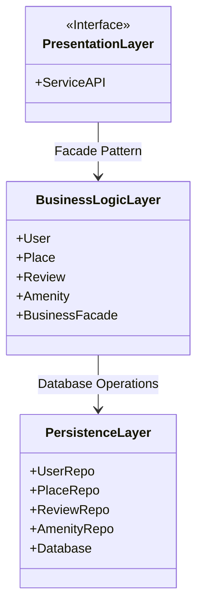
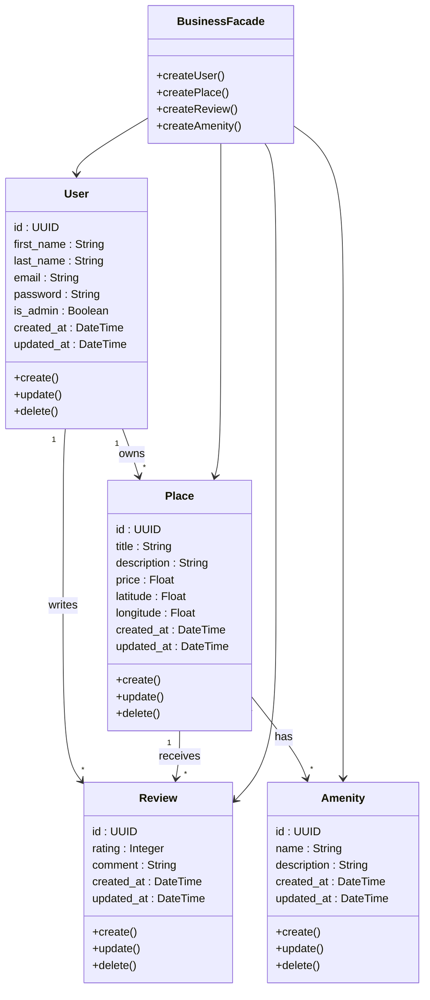

# HBnB Technical Documentation

## Table of Contents
1. [Introduction](#introduction)
2. [High-Level Architecture](#high-level-architecture)
3. [Business Logic Layer](#business-logic-layer)

---

## Introduction

**Purpose:**
This document compiles all the diagrams and explanatory notes for the HBnB project. It serves as a detailed blueprint guiding the implementation phases and providing a clear reference for the system’s architecture and design.

**Scope:**
- Overview of HBnB project architecture
- Layered design and interaction patterns
- Detailed class definitions and relationships
- API interaction flows with sequence diagrams
- Explanatory notes to clarify design decisions

---

## High-Level Architecture

**Purpose of this Diagram:**
Illustrates the overall structure of HBnB, highlighting the main layers and modules, and showing how they interact.

**Diagram:**

**Explanatory Notes:**
- **Layers Overview:**
  - **Presentation Layer:** Handles user interface and interaction.
  - **Business Logic Layer:** Core functionality and business rules.
  - **Persistence Layer:** Data storage and retrieval.
- **Design Decisions:**
  - Layered architecture allows modular development and separation of concerns.
  - Use of **Facade Pattern** simplifies interactions between layers.
- **Integration:**
  - Each layer communicates through well-defined interfaces, ensuring maintainability and scalability.

---

## Business Logic Layer

**Purpose of this Diagram:**
Provides a detailed view of the Business Logic Layer, showing the main entities, their attributes, and relationships.

**Diagram:**

**Explanatory Notes:**
- **Key Entities:**
  - `User` – Represents registered users of HBnB.
  - `Place` – Represents accommodations available for booking.
  - `Review` – Represents user reviews for places.
  - `Amenity` – Represents facilities available in each place.
  - `BusinessFacade` – Provides simplified access to business logic functions.
- **Relationships:**
  - `User` can write multiple `Reviews`.
  - `Place` contains multiple `Amenities`.
  - `BusinessFacade` coordinates operations across entities.
- **Design Decisions:**
  - Use of `Facade` centralizes logic and reduces direct coupling.
  - Each entity encapsulates its own behavior and data integrity rules.

---
