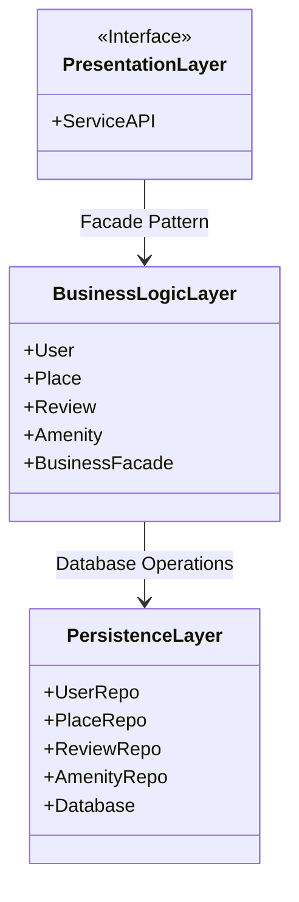
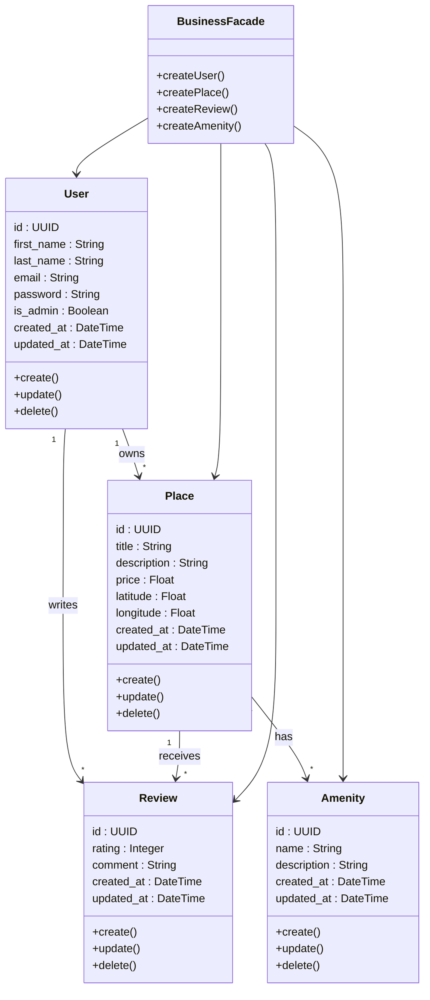
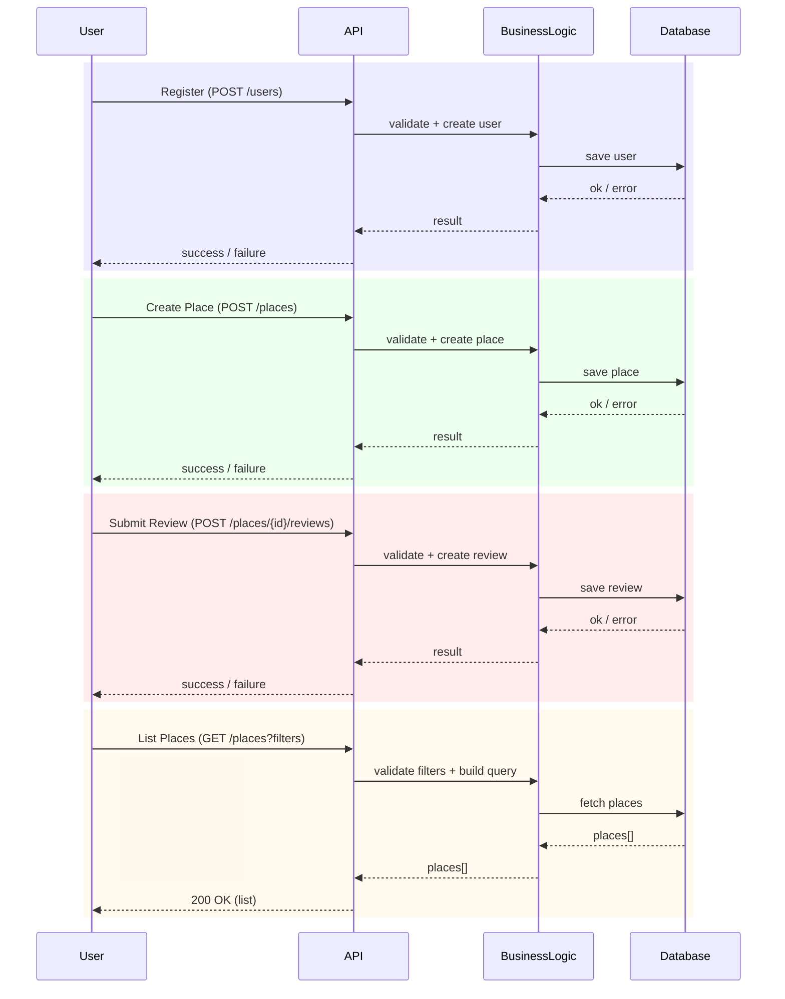

# HBnB Technical Documentation

## Table of Contents
1. [Introduction](#introduction)
2. [High-Level Architecture](#high-level-architecture)
3. [Business Logic Layer](#business-logic-layer)

---

## Introduction

**Purpose:**
This document compiles all the diagrams and explanatory notes for the HBnB project. It serves as a detailed blueprint guiding the implementation phases and providing a clear reference for the system’s architecture and design.

**Scope:**
- Overview of HBnB project architecture
- Layered design and interaction patterns
- Detailed class definitions and relationships
- API interaction flows with sequence diagrams
- Explanatory notes to clarify design decisions

---

## High-Level Architecture

**Purpose of this Diagram:**
Illustrates the overall structure of HBnB, highlighting the main layers and modules, and showing how they interact.

**Diagram:**

**Explanatory Notes:**
- **Layers Overview:**
  - **Presentation Layer:** Handles user interface and interaction.
  - **Business Logic Layer:** Core functionality and business rules.
  - **Persistence Layer:** Data storage and retrieval.
- **Design Decisions:**
  - Layered architecture allows modular development and separation of concerns.
  - Use of **Facade Pattern** simplifies interactions between layers.
- **Integration:**
  - Each layer communicates through well-defined interfaces, ensuring maintainability and scalability.

---

## Business Logic Layer

**Purpose of this Diagram:**
Provides a detailed view of the Business Logic Layer, showing the main entities, their attributes, and relationships.

**Diagram:**

**Explanatory Notes:**
- **Key Entities:**
  - `User` – Represents registered users of HBnB.
  - `Place` – Represents accommodations available for booking.
  - `Review` – Represents user reviews for places.
  - `Amenity` – Represents facilities available in each place.
  - `BusinessFacade` – Provides simplified access to business logic functions.
- **Relationships:**
  - `User` can write multiple `Reviews`.
  - `Place` contains multiple `Amenities`.
  - `BusinessFacade` coordinates operations across entities.
- **Design Decisions:**
  - Use of `Facade` centralizes logic and reduces direct coupling.
  - Each entity encapsulates its own behavior and data integrity rules.

---

Les 4 acteurs du diagramme
	•	User : l’utilisateur (ou un outil comme Postman) qui déclenche une action via une requête HTTP.
	•	API (Presentation Layer) : la porte d’entrée de l’application. Elle reçoit la requête, vérifie que les données sont cohérentes (champs requis, formats, paramètres), puis prépare la réponse HTTP.
	•	BusinessLogic (Business Layer) : la couche “métier”. Elle applique les règles de l’application (création d’objets, contrôles, décisions) et orchestre les opérations nécessaires.
	•	Database (Persistence Layer) : la couche de persistance. Elle enregistre les informations (save) ou renvoie des résultats (fetch) à partir de la base de données.

⸻

1) User Registration — Inscription d’un utilisateur

L’utilisateur envoie une demande d’inscription. L’API valide les informations de base, puis transmet à la logique métier qui crée l’utilisateur. La base de données enregistre ensuite ce nouvel utilisateur. Enfin, le résultat remonte : succès si le compte est créé, sinon échec en cas de problème.

⸻

2) Place Creation — Création d’une annonce

L’utilisateur crée un “place” (une annonce). L’API vérifie les données envoyées, la logique métier construit l’objet “place” et applique les règles nécessaires, puis la base de données sauvegarde l’annonce. La réponse renvoyée indique si la création a réussi ou non.

⸻

3) Review Submission — Envoi d’un avis

L’utilisateur soumet une review sur un place. L’API valide le contenu (par exemple le texte et la note), la logique métier crée la review, puis la base de données l’enregistre. Comme pour les autres appels, la réponse finale indique succès ou erreur.

⸻

4) Fetching a List of Places — Récupérer une liste

L’utilisateur demande une liste de places selon des critères. L’API vérifie et interprète les paramètres, la logique métier construit la recherche, puis la base de données renvoie une liste de résultats. L’API retourne ensuite une réponse 200 OK contenant la liste.

