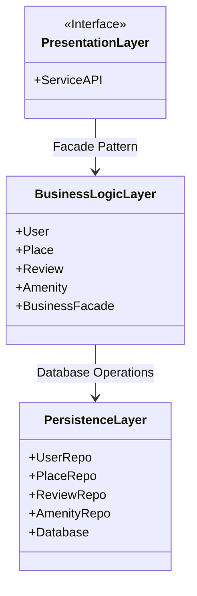
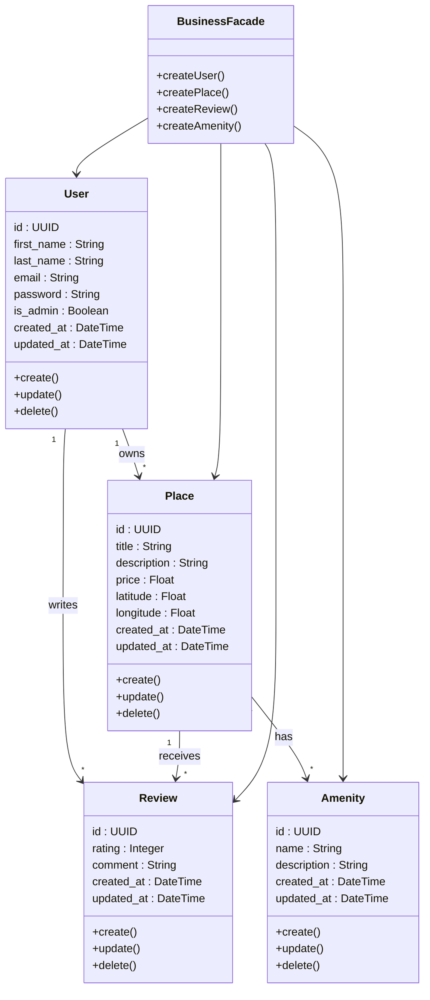
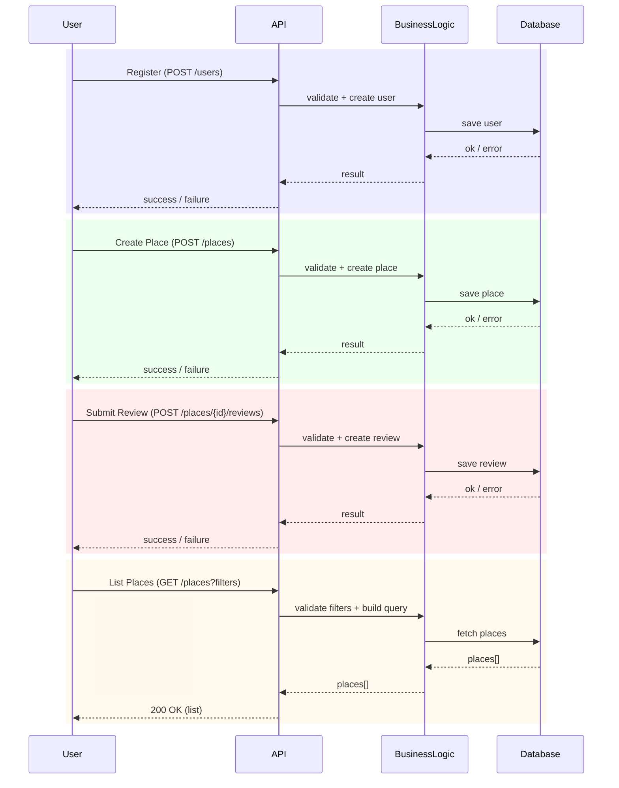

# HBnB Technical Documentation

## Table of Contents
1. [Introduction](#introduction)
2. [High-Level Architecture](#high-level-architecture)
3. [Business Logic Layer](#business-logic-layer)
4. [Sequence Diagram](#sequence-diagram)
5. [Authors](#authors)

---

## Introduction

**Purpose:**
This document compiles all the diagrams and explanatory notes for the HBnB project. It serves as a detailed blueprint guiding the implementation phases and providing a clear reference for the system’s architecture and design.

**Scope:**
- Overview of HBnB project architecture
- Layered design and interaction patterns
- Detailed class definitions and relationships
- API interaction flows with sequence diagrams
- Explanatory notes to clarify design decisions

---

## High-Level Architecture

**Purpose of this Diagram:**
Illustrates the overall structure of HBnB, highlighting the main layers and modules, and showing how they interact.

**Diagram:**

**Explanatory Notes:**
- **Layers Overview:**
  - **Presentation Layer:** Handles user interface and interaction.
  - **Business Logic Layer:** Core functionality and business rules.
  - **Persistence Layer:** Data storage and retrieval.
- **Design Decisions:**
  - Layered architecture allows modular development and separation of concerns.
  - Use of **Facade Pattern** simplifies interactions between layers.
- **Integration:**
  - Each layer communicates through well-defined interfaces, ensuring maintainability and scalability.

---

## Business Logic Layer

**Purpose of this Diagram:**
Provides a detailed view of the Business Logic Layer, showing the main entities, their attributes, and relationships.

**Diagram:**

**Explanatory Notes:**
- **Key Entities:**
  - `User` – Represents registered users of HBnB.
  - `Place` – Represents accommodations available for booking.
  - `Review` – Represents user reviews for places.
  - `Amenity` – Represents facilities available in each place.
  - `BusinessFacade` – Provides simplified access to business logic functions.
- **Relationships:**
  - `User` can write multiple `Reviews`.
  - `Place` contains multiple `Amenities`.
  - `BusinessFacade` coordinates operations across entities.
- **Design Decisions:**
  - Use of `Facade` centralizes logic and reduces direct coupling.
  - Each entity encapsulates its own behavior and data integrity rules.

---

## Sequence Diagram

**Purpose of this Diagram:**  
This sequence diagram illustrates how API requests flow through the three-layer architecture of HBnB (Presentation → Business Logic → Persistence). It highlights the responsibilities of each layer and the step-by-step interactions required to fulfill common use cases.

**Diagram:**

### Explanatory Notes

- **User (Client):**  
  The end user (or an API testing tool) that sends an HTTP request to trigger an action.

- **API (Presentation Layer):**  
  The entry point of the application. It:
  - Validates input data (required fields, formats, query parameters)
  - Handles errors
  - Constructs and returns HTTP responses

- **BusinessLogic (Business Logic Layer):**  
  The core layer responsible for:
  - Applying business rules
  - Creating domain objects
  - Orchestrating operations between components
  - Coordinating persistence actions

- **Database (Persistence Layer):**  
  Responsible for storing and retrieving data. It:
  - Saves new entities
  - Fetches records
  - Returns operation status or result sets

---

### Use Cases Covered

**1) User Registration — `POST /users`**  
Goal: Create a new user account.  
Flow: The user sends a registration request → the API validates the payload → BusinessLogic creates the user → the Database stores the new user → the API returns success or failure.

---

**2) Place Creation — `POST /places`**  
Goal: Create a new place listing.  
Flow: The user submits place data → the API validates input → BusinessLogic builds the place object and applies rules → the Database saves the place → the API returns success or failure.

---

**3) Review Submission — `POST /places/{id}/reviews`**  
Goal: Submit a review for a specific place.  
Flow: The user submits a review → the API validates input → BusinessLogic creates the review → the Database stores it → the API returns success or error.

---

**4) Fetching a List of Places — `GET /places?filters`**  
Goal: Retrieve a list of places based on filtering criteria.  
Flow: The user sends filters → the API parses and validates query parameters → BusinessLogic builds the search query → the Database returns matching places → the API responds with `200 OK` and the results.

---

## Authors

- [Anthony Goutieras](https://github.com/AGoutieras)
- [Anthony Di Domenico](https://github.com/Anthodido)

