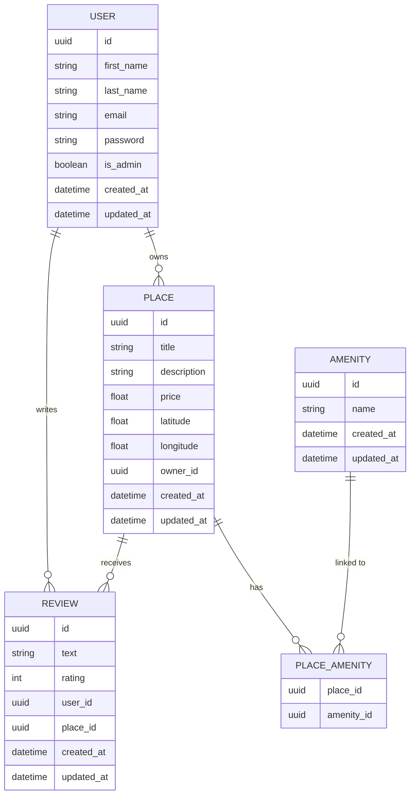

<a href="#"></a>
<a href="#"></a>
<a href="#"></a>
<a href="#"></a>
[](https://www.holbertonschool.fr/)

# HBnB Part 3: Enhanced Backend with Authentication & Database Integration

This is the third part of the **HBnB** project, the AirBnB clone.
Building on Part 2's business logic and REST API, this part introduces **JWT authentication**, **role-based access control**, and **SQLite database persistence** via SQLAlchemy ORM.

## Table of Contents

1. [File Structure](#file-structure)
2. [Requirements](#requirements)
3. [Setup & Installation](#setup--installation)
4. [Configuration](#configuration)
5. [Database Initialization](#database-initialization)
6. [API Usage](#api-usage)
   - [Authentication](#authentication)
   - [Users](#users)
   - [Amenities](#amenities)
   - [Places](#places)
   - [Reviews](#reviews)
7. [ER Diagram](#er-diagram)
8. [Running Tests](#running-tests)
9. [Authors](#authors)

---

## File Structure

```text
hbnb/
├── app/
│   ├── __init__.py              # Application factory (Flask, JWT, Bcrypt, SQLAlchemy)
│   ├── api/
│   │   ├── __init__.py
│   │   └── v1/
│   │       ├── __init__.py
│   │       ├── auth.py          # Login endpoint
│   │       ├── amenities.py
│   │       ├── places.py
│   │       ├── reviews.py
│   │       └── users.py
│   ├── models/
│   │   ├── __init__.py
│   │   ├── base_model.py        # SQLAlchemy BaseModel (id, created_at, updated_at)
│   │   ├── amenity.py
│   │   ├── place.py             # Includes place_amenity association table
│   │   ├── review.py
│   │   └── user.py              # Includes hash_password / verify_password
│   ├── persistence/
│   │   ├── __init__.py
│   │   └── repository.py        # Repository interface + SQLAlchemyRepository
│   └── services/
│       ├── __init__.py          # Instantiates HBnBFacade as `facade`
│       └── facade.py            # Business logic layer
├── sql/
│   ├── schema.sql               # SQL schema creation script
│   └── initial_data.sql         # SQL initial data (admin user + amenities)
├── config.py                    # DevelopmentConfig (SQLite)
├── requirements.txt
├── run.py                       # Entry point
├── tests.py                     # Unit tests
└── Diagram.mmd                  # Mermaid.js ER diagram
```

**Key design decisions:**

- `BaseModel` is a SQLAlchemy abstract model — all entities inherit `id` (UUID), `created_at`, and `updated_at` from it.
- The `place_amenity` association table is defined in `place.py` to manage the many-to-many relationship between `Place` and `Amenity`.
- `User` defines `places` and `reviews` relationships via `backref`, so `place.owner` and `review.author` are accessible without extra queries.
- The `SQLAlchemyRepository` is a generic implementation of the `Repository` interface, used for all entities.
- The application factory (`create_app`) automatically runs `db.create_all()` and seeds the admin user on startup.

---

## Requirements

```text
flask
flask-restx
flask-bcrypt
flask-jwt-extended
sqlalchemy
flask-sqlalchemy
```

Install with:

```bash
pip install -r requirements.txt
```

---

## Setup & Installation

```bash
# Clone the repository
git clone https://github.com/AGoutieras/holbertonschool-hbnb.git
cd hbnb

# Create and activate the virtual environment
python3 -m venv venv
source venv/bin/activate

# Install dependencies
pip install -r requirements.txt

# Run the application
python3 run.py
```

---

## Configuration

`config.py` defines:

| Class | Details |
|---|---|
| `Config` | `SECRET_KEY` (from env or `default_secret_key`), `DEBUG=False` |
| `DevelopmentConfig` | `DEBUG=True`, `SQLALCHEMY_DATABASE_URI = sqlite:///development.db`, `SQLALCHEMY_TRACK_MODIFICATIONS=False` |

The `SECRET_KEY` is used by both Flask session and `flask-jwt-extended` to sign tokens.

```bash
export SECRET_KEY=your_secret_key  # optional, defaults to 'default_secret_key'
```

---

## Database Initialization

The database is automatically initialized on startup via `db.create_all()` inside the application factory.

Alternatively, you can apply the raw SQL scripts manually:

```bash
sqlite3 instance/development.db < sql/schema.sql
sqlite3 instance/development.db < sql/initial_data.sql
```

`initial_data.sql` seeds:
- An **admin user**: `admin@hbnb.io` / `admin1234` (bcrypt-hashed)
- Three **amenities**: WiFi, Swimming Pool, Air Conditioning

> The application factory also creates the admin user automatically on first startup if not present (password: `admin123`).

---

## API Usage

### Authentication

#### Login — `POST /api/v1/auth/login`

```bash
curl -X POST http://localhost:5000/api/v1/auth/login \
  -H "Content-Type: application/json" \
  -d '{"email": "admin@hbnb.io", "password": "admin123"}'
```

Expected output:

```json
{
    "access_token": "<your_jwt_token>"
}
```

Pass the token in all protected requests via the `Authorization` header:

```
Authorization: Bearer <your_jwt_token>
```

---

### Users

#### Create a user — `POST /api/v1/users/` *(Admin only)*

```bash
curl -X POST http://localhost:5000/api/v1/users/ \
  -H "Content-Type: application/json" \
  -H "Authorization: Bearer <admin_token>" \
  -d '{"first_name": "John", "last_name": "Doe", "email": "john.doe@example.com", "password": "password123"}'
```

Expected output:

```json
{
    "id": "7e2c744b-93a3-44f0-9831-16d88acbbcd3",
    "first_name": "John",
    "last_name": "Doe",
    "email": "john.doe@example.com"
}
```

#### Get all users — `GET /api/v1/users/` *(Public)*

```bash
curl -X GET http://localhost:5000/api/v1/users/
```

#### Get a user by ID — `GET /api/v1/users/<user_id>` *(Public)*

```bash
curl -X GET http://localhost:5000/api/v1/users/<user_id>
```

Expected output:

```json
{
    "id": "7e2c744b-93a3-44f0-9831-16d88acbbcd3",
    "first_name": "John",
    "last_name": "Doe",
    "email": "john.doe@example.com"
}
```

#### Update a user — `PUT /api/v1/users/<user_id>` *(Authenticated)*

Regular users can only update their own account and cannot modify `email` or `password`.
Admins can update any user including `email` and `password` (email uniqueness is enforced).

```bash
curl -X PUT http://localhost:5000/api/v1/users/<user_id> \
  -H "Content-Type: application/json" \
  -H "Authorization: Bearer <token>" \
  -d '{"first_name": "Jane", "last_name": "Doe"}'
```

Expected output:

```json
{
    "id": "7e2c744b-93a3-44f0-9831-16d88acbbcd3",
    "first_name": "Jane",
    "last_name": "Doe",
    "email": "john.doe@example.com"
}
```

---

### Amenities

#### Create an amenity — `POST /api/v1/amenities/` *(Admin only)*

```bash
curl -X POST http://localhost:5000/api/v1/amenities/ \
  -H "Content-Type: application/json" \
  -H "Authorization: Bearer <admin_token>" \
  -d '{"name": "Wi-Fi"}'
```

Expected output:

```json
{
    "id": "602a65eb-d7a2-4dc8-8fbd-56437b0bfd9f",
    "name": "Wi-Fi"
}
```

#### Get all amenities — `GET /api/v1/amenities/` *(Public)*

```bash
curl -X GET http://localhost:5000/api/v1/amenities/
```

#### Get an amenity by ID — `GET /api/v1/amenities/<amenity_id>` *(Public)*

```bash
curl -X GET http://localhost:5000/api/v1/amenities/<amenity_id>
```

Expected output:

```json
{
    "id": "602a65eb-d7a2-4dc8-8fbd-56437b0bfd9f",
    "name": "Wi-Fi"
}
```

#### Update an amenity — `PUT /api/v1/amenities/<amenity_id>` *(Admin only)*

```bash
curl -X PUT http://localhost:5000/api/v1/amenities/<amenity_id> \
  -H "Content-Type: application/json" \
  -H "Authorization: Bearer <admin_token>" \
  -d '{"name": "Air Conditioning"}'
```

Expected output:

```json
{
    "message": "Amenity updated successfully"
}
```

---

### Places

#### Create a place — `POST /api/v1/places/` *(Authenticated)*

The `owner_id` is automatically set from the JWT token, regardless of what is passed in the payload.

```bash
curl -X POST http://localhost:5000/api/v1/places/ \
  -H "Content-Type: application/json" \
  -H "Authorization: Bearer <token>" \
  -d '{
    "title": "Cozy Apartment",
    "description": "A nice place to stay",
    "price": 100.0,
    "latitude": 37.7749,
    "longitude": -122.4194,
    "owner_id": "<ignored>",
    "amenities": ["<amenity_id>"]
  }'
```

Expected output:

```json
{
    "id": "86610800-61c9-4b32-b3ca-a6eaeaf24a77",
    "title": "Cozy Apartment",
    "description": "A nice place to stay",
    "price": 100.0,
    "latitude": 37.7749,
    "longitude": -122.4194,
    "owner_id": "7e2c744b-93a3-44f0-9831-16d88acbbcd3"
}
```

#### Get all places — `GET /api/v1/places/` *(Public)*

```bash
curl -X GET http://localhost:5000/api/v1/places/
```

#### Get a place by ID — `GET /api/v1/places/<place_id>` *(Public)*

```bash
curl -X GET http://localhost:5000/api/v1/places/<place_id>
```

Expected output:

```json
{
    "id": "86610800-61c9-4b32-b3ca-a6eaeaf24a77",
    "title": "Cozy Apartment",
    "description": "A nice place to stay",
    "latitude": 37.7749,
    "longitude": -122.4194,
    "owner": {
        "id": "7e2c744b-93a3-44f0-9831-16d88acbbcd3",
        "first_name": "John",
        "last_name": "Doe",
        "email": "john.doe@example.com"
    },
    "amenities": [
        {
            "id": "602a65eb-d7a2-4dc8-8fbd-56437b0bfd9f",
            "name": "Wi-Fi"
        }
    ]
}
```

#### Update a place — `PUT /api/v1/places/<place_id>` *(Owner or Admin)*

Admins can update any place. Regular users can only update places they own.

```bash
curl -X PUT http://localhost:5000/api/v1/places/<place_id> \
  -H "Content-Type: application/json" \
  -H "Authorization: Bearer <token>" \
  -d '{"title": "Luxury Condo", "description": "An upscale place to stay", "price": 200.0}'
```

Expected output:

```json
{
    "message": "Place updated successfully"
}
```

#### Get all reviews for a place — `GET /api/v1/places/<place_id>/reviews` *(Public)*

```bash
curl -X GET http://localhost:5000/api/v1/places/<place_id>/reviews
```

---

### Reviews

#### Create a review — `POST /api/v1/reviews/` *(Authenticated)*

Constraints enforced:
- Cannot review your own place → `400 You cannot review your own place.`
- Cannot review the same place twice → `400 You have already reviewed this place.`

```bash
curl -X POST http://localhost:5000/api/v1/reviews/ \
  -H "Content-Type: application/json" \
  -H "Authorization: Bearer <token>" \
  -d '{"text": "Great place to stay!", "rating": 5, "user_id": "<user_id>", "place_id": "<place_id>"}'
```

Expected output:

```json
{
    "id": "6dbd7e6a-8dbc-429f-b534-faa75b8a5307",
    "text": "Great place to stay!",
    "rating": 5,
    "user_id": "7e2c744b-93a3-44f0-9831-16d88acbbcd3",
    "place_id": "86610800-61c9-4b32-b3ca-a6eaeaf24a77"
}
```

#### Get all reviews — `GET /api/v1/reviews/` *(Public)*

```bash
curl -X GET http://localhost:5000/api/v1/reviews/
```

#### Get a review by ID — `GET /api/v1/reviews/<review_id>` *(Public)*

```bash
curl -X GET http://localhost:5000/api/v1/reviews/<review_id>
```

#### Update a review — `PUT /api/v1/reviews/<review_id>` *(Author or Admin)*

```bash
curl -X PUT http://localhost:5000/api/v1/reviews/<review_id> \
  -H "Content-Type: application/json" \
  -H "Authorization: Bearer <token>" \
  -d '{"text": "Amazing stay!", "rating": 4}'
```

Expected output:

```json
{
    "message": "Review updated successfully"
}
```

#### Delete a review — `DELETE /api/v1/reviews/<review_id>` *(Author or Admin)*

```bash
curl -X DELETE http://localhost:5000/api/v1/reviews/<review_id> \
  -H "Authorization: Bearer <token>"
```

Expected output:

```json
{
    "message": "Review deleted successfully"
}
```

---

## ER Diagram



---

## Running Tests

```bash
python3 -m unittest tests.py
```

The test suite covers:

- `POST` — creation of users, amenities, places, reviews (valid and invalid inputs)
- `GET` — retrieval by ID and full listing for all entities
- `PUT` — update of users, amenities, places, reviews (valid and invalid IDs)
- `DELETE` — deletion of reviews

---

## Authors

This project was made for `Holberton School Bordeaux` by

[Anthony Goutieras](https://github.com/AGoutieras)

[Anthony Di Domenico](https://github.com/anthodido)
